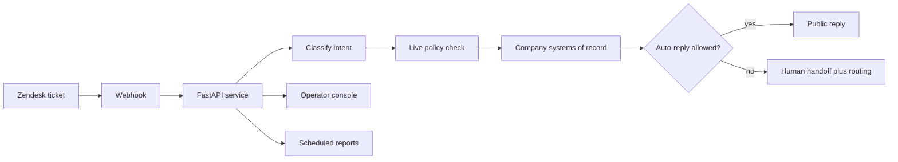
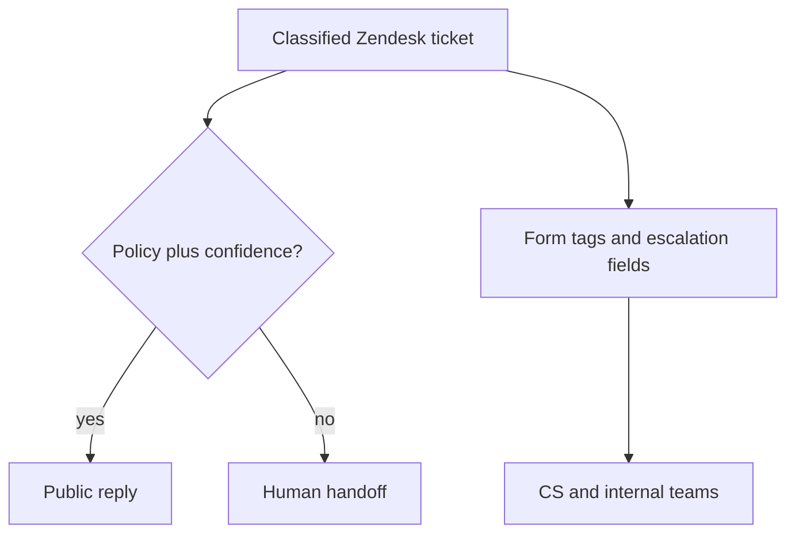

# Dani — KOCOWA CS automation case study

Production FastAPI service that classifies KOCOWA Zendesk email and web-form tickets, then auto-replies or hands off using live policy and company data — not LLM guesses.

I designed, built, and operate **Dani** at [wavve Americas](https://www.wavve.com/) (KOCOWA / KOCOWA+).

This repository is a **case study only**. It does not contain source code, configs, prompts, knowledge-base content, or operational data. The production system stays in a private company repository.

**Status:** production service, still expanding which ticket types may auto-reply. Not a finished “full automation” product.

---

## Problem

KOCOWA customer support handles high-volume, multilingual email and web-form tickets: billing, account deletion, playback, subtitles, catalog availability, region access, and how-to questions.

An unconstrained LLM reply is unsafe. A wrong “yes, we have that title,” a guessed App Store vs Stripe cancel path, or a promised account deletion can create chargebacks, bad catalog claims, or privacy issues.

The work needed classification, routing, and *limited* auto-reply — without treating the model as the catalog or billing system of record.

## Role

I specified behavior, implemented the service, operate the production Docker host, and decide policy: which intents may auto-reply vs hand off to a human.

I did **not** build the company’s customer-account API. Dani consumes that service; another engineer authored it.

## What shipped

- End-to-end ticket pipeline: ingest from Zendesk, classify, apply policy, reply or hand off
- Intent taxonomy, classifier, and scope guard, with form-field and screenshot context when the email body is not enough
- Specialized first-email handlers for catalog, subtitles, region, cancel path, subscription visibility, and account deletion
- Ticket routing even when Dani does not send a public reply (form, tags, escalation fields)
- Live, auditable automation policy so operators can turn intents on without a Python deploy
- Flask operator console (overview, metrics, policy toggles, audit history). The browser never holds API keys.
- Process/error logging and internal chat alerts
- Scheduled support-metrics reporting
- Docker Compose for the API, console, and reporting jobs
- Tests around high-risk rules (catalog claims, cancel path, policy gates)

## Stack

Python 3.12, FastAPI, Flask, Pydantic, pytest, MySQL, Docker Compose, Zendesk Support API, OpenAI API.

## Architecture

Flow in words:

1. Zendesk sends a ticket payload. The API acknowledges quickly, then waits in production so form fields can finish landing.
2. Idempotent tags prevent webhook retries from double-replying.
3. The service fetches the ticket (including custom fields and optional screenshots), classifies it, and loads the live automation policy.
4. Catalog, entitlement, and billing facts come from company databases and APIs — not from the model.
5. If policy and confidence allow, Dani sends a public reply. Otherwise it hands off with structured notes, tags, and escalation fields.
6. Operators use the console to review coverage and flip intent toggles. Reporting jobs publish metrics on a schedule.

Three outcomes, not one:

A ticket can be routed even when Dani does not send a public reply. That is intentional: organization is valuable before auto-reply coverage is complete.

## Deep dives

### 1. The model is not the catalog

**Situation.** KOCOWA tickets often ask “do you have this show?” or “are Korean subtitles live?” An unconstrained LLM will answer from training data or from the email’s tone.

**Constraint.** A wrong yes is worse than no reply: bad catalog claims, angry follow-ups, and trust loss with CS.

**What I built.** Dani classifies first. Catalog, subtitle, region, and entitlement answers come from company systems of record. The model drafts language only after those lookups. If the lookup is missing or confidence is low, Dani hands off.

**What changed.** First-email handlers for title availability and subtitles can auto-reply without inventing facts. CS still gets a structured ticket when the bot should stay quiet.

### 2. Most tickets still go to a human, on purpose

**Situation.** From mid-2026 Dani queues almost all in-scope email and web Zendesk tickets. Auto-reply is only a slice of that queue.

**Constraint.** “Full automation” would mean enabling intents that are not safe yet (billing cancel, some region and license requests). CS did not want a bot that sounds confident while policy is still off.

**What I built.** Every queued ticket still gets form routing, sub-intent tags, and escalation fields. Human handoff is the default when an intent is disabled. Policy-off is logged as a handoff reason, not as a model failure.

**What changed.** Coverage means Dani *sees* the ticket. Success also means CS and Content / Engineering / Planning / BizDev get a sorted ticket when Dani does not answer.

### 3. CS can turn intents on without a deploy

**Situation.** Early on, disabling an intent meant a config change and a ship. That is too slow when a handler is wrong in production.

**Constraint.** Operators need to own the risk of enabling auto-reply. Engineering should not be the on/off switch for every sub-intent.

**What I built.** Live MySQL policy rows, a GET/PATCH API, and a Flask console with audit history. The browser never holds API keys. CS can flip a sub-intent; the API process reads the new row on the next ticket.

**What changed.** Promotion is a loop: take a real Zendesk ticket, run it in dev, fix if wrong, enable in prod when CS agrees. Python deploys are for behavior, not for toggling.

### 4. Billing is never “the bot cancelled it”

**Situation.** Cancel-and-stop-charges tickets mix App Store, Google Play, and Stripe. The email text is a bad source of truth.

**Constraint.** Dani must never cancel a subscription. A guessed App Store path, or a bot-executed Stripe cancel, creates chargebacks and privacy/billing risk.

**What I built.** Cancel path is looked up from the account’s payment gateway, not parsed from the email. App-store customers get self-serve steps. Stripe goes to a human. Account-deletion mail gets in-app steps or a handoff — Dani does not delete the account.

**What changed.** Auto-reply is allowed only where the path is safe and policy is on. Stripe cancellations stay with CS.

## Engineering decisions

| Problem | What landed |
| --- | --- |
| LLM inventing catalog or billing facts | Classify + tools. Company systems of record answer availability, entitlement, and cancel path. Confidence and policy gates. |
| Webhook retries double-replying | Idempotent processing tags. |
| Title or language only on the form or in a screenshot | Fetch ticket fields and optional image analysis, not a larger webhook blob. |
| Late form fields vs immediate classify | Short processing delay in production (skipped in test). |
| Turning intents off required a deploy | MySQL policy rows + API + console audit history. |
| Reporting hitting Zendesk on every dashboard load | Batch snapshots instead of a write on every ticket. |
| Stripe cancel vs App Store self-serve | Dani never cancels. App stores get self-serve steps; Stripe goes to a human. |
| Chat noise | End-of-run summaries on separate channels from errors and escalations. |
| Draft replies on handoffs | Switchable after CS said they barely used them. |

## Outcomes (honest)

Qualitative, supported:

- Production Docker stack (API, console, reporter) is running.
- From mid-2026 onward, Dani **queues almost all in-scope email/web tickets** — most still hand off because many intents remain off by policy, not because the model failed.
- Auto-reply volume rose as specialized handlers shipped, especially technical-support cases.
- Tickets are **organized even when Dani does not answer**: form routing and escalation fields still land for CS and internal teams.
- Operators can enable or disable sub-intents without shipping Python.

I am **not** claiming CSAT, hours saved, cost savings, deflection rate, or “all tickets auto-reply.” Those were not measured here.

## Resume bullets

- Built and operate Dani, a production Python/FastAPI service that classifies KOCOWA Zendesk email/web tickets with an LLM, then auto-replies or hands off using confidence gates and a live, auditable MySQL automation policy.
- Implemented first-email automations that query internal catalog and account systems so subtitle, title-availability, region, and cancel-path answers are not model guesses; Stripe cancellations are never executed by the bot.
- Shipped Zendesk form routing, sub-intent tags, and escalation fields so tickets are organized for CS and internal teams even when Dani does not send a public reply.
- Built a Flask operator console (overview, metrics, policy, audit) plus Docker Compose deployment of API, console, and scheduled reporting.
